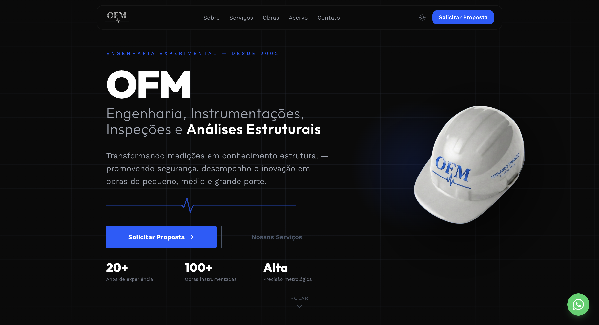

# OFM Engenharia — Site Institucional

Site institucional da OFM — Engenharia, Instrumentações, Inspeções e Análises Estruturais,
empresa especializada em instrumentação e análise experimental de estruturas civis e industriais.

**Acesso:** [ofmengenharia.com.br](https://ofmengenharia.com.br)



---

## Stack

| Camada    | Tecnologia                                                    |
| --------- | ------------------------------------------------------------- |
| Framework | Next.js 16 (App Router, `output: 'export'`)                   |
| Linguagem | TypeScript                                                    |
| Estilo    | Tailwind CSS v4                                               |
| Fontes    | Outfit (títulos) + Work Sans (corpo) — via `next/font/google` |
| Deploy    | Vercel (export estático)                                      |

---

## Estrutura

```text
/app
  layout.tsx            — metadados globais, fontes e configurações
  page.tsx              — composição das seções da página principal
  /obras
    /museu-do-amanha/              — página de detalhe de obra
    /ponte-rio-niteroi/            — página de detalhe de obra
    /ponte-estaiada-octavio-frias/ — página de detalhe de obra
    /ponte-newton-navarro/         — página de detalhe de obra
  /servicos
    page.tsx            — listagem de todos os serviços
    /[slug]/
      page.tsx          — shell server component (generateStaticParams)
      PaginaServico.tsx — UI client component com hooks

/components
  Navegacao.tsx         — navbar flutuante (ilha) com logo e toggle de tema
  Capa.tsx              — seção hero com fundo blueprint
  Sobre.tsx             — história e timeline com logos institucionais
  Servicos.tsx          — 5 serviços âncora na home + link para /servicos
  ObrasDestaque.tsx     — portfólio de obras com cards clicáveis
  AcervoTecnico.tsx     — acervo técnico, normas e softwares utilizados
  Contato.tsx           — formulário de proposta via WhatsApp ou e-mail
  Rodape.tsx            — rodapé com dados institucionais (CNPJ, RT)
  BotaoWhatsApp.tsx     — botão flutuante de contato
  ProvedorTema.tsx      — wrapper next-themes (dark/light)
  BotaoTema.tsx         — toggle de tema com SVG (sol/lua)

/data
  servicos-detalhados.tsx — fonte de verdade para páginas de detalhe de serviços
                            (interface ServicoDetalhado, array servicosDetalhados)

/hooks
  useScrollReveal.ts    — IntersectionObserver nativo para animações de entrada

/public/images/
  /Obras/               — fotos organizadas por obra (subpasta por nome da obra)
  /Servicos/            — fotos editoriais organizadas por slug de serviço
  /Logos/               — logos institucionais (OFM, USP, Falcão Bauer)

/docs
  /adr                  — Architecture Decision Records
  /handoff              — documentos de handoff entre sessões (gitignore)
```

---

## Pré-requisitos

- Node.js 18+
- npm 9+

## Como rodar localmente

```bash
npm install
npm run dev       # http://localhost:3000
```

## Build e deploy

```bash
npm run build     # gera export estático em /out
npm run lint      # verificação ESLint
```

O deploy é feito automaticamente via Vercel a cada push na branch `main`.

## Variáveis de ambiente

Este projeto não utiliza variáveis de ambiente. Não há backend, banco de dados ou serviços externos autenticados.

- Número de WhatsApp: hardcoded em `Contato.tsx`
- E-mail de contato: hardcoded em `Contato.tsx`

---

## Formulário de contato

Não utiliza backend. O usuário preenche os campos e escolhe o canal de envio:

- **WhatsApp** — abre `wa.me/5511964866459` com a mensagem pré-formatada
- **E-mail** — abre o cliente de e-mail com `mailto:ofmengenharia@ofmengenharia.com.br`, assunto e corpo pré-preenchidos

## Tema claro/escuro

O site oferece alternância entre tema escuro (padrão) e claro via `next-themes`.
O toggle fica na navbar. O tema é persistido no `localStorage` do navegador.
As cores são controladas inteiramente por CSS custom properties em `app/globals.css`.

---

## Páginas de serviços

Os serviços têm dois níveis de acesso:

- **Home (`/`):** 5 serviços âncora com link "Ver todos os serviços" → `/servicos`
- **Listagem (`/servicos`):** todos os 13 serviços organizados por categoria
- **Detalhe (`/servicos/[slug]`):** conteúdo completo com métricas, aplicações, galeria e normas

O conteúdo de cada serviço fica em `data/servicos-detalhados.tsx`. Para adicionar um novo serviço:

1. Adicionar entrada em `servicosDetalhados` (array em `data/servicos-detalhados.tsx`)
2. Adicionar card em `components/Servicos.tsx` se for âncora na home

## Portfólio de obras

As obras em destaque ficam em `components/ObrasDestaque.tsx`. Obras com página dedicada:

- Museu do Amanhã — `/obras/museu-do-amanha`
- Ponte Rio-Niterói — `/obras/ponte-rio-niteroi`

As fotos ficam em `/public/images/`. Obras sem foto usam placeholder escuro com ícone.

---

## Desenvolvido por

[Weslley Cardoso](https://github.com/Carti011)
