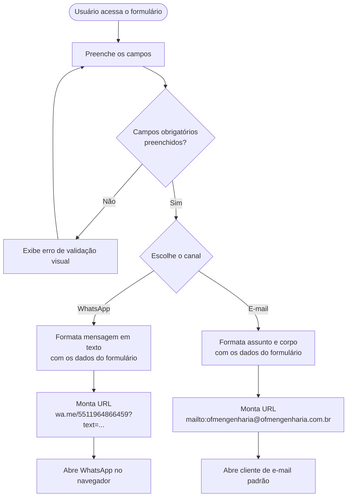

# Diagrama de Fluxo — Formulário de Contato

Fluxo completo do formulário de proposta em `components/Contato.tsx`.

## Campos do formulário

| Campo        | Obrigatório | Tipo     |
|--------------|-------------|----------|
| Nome         | Sim         | texto    |
| Empresa      | Não         | texto    |
| Telefone     | Sim         | texto    |
| Serviço      | Sim         | select   |
| Descrição    | Não         | textarea |

## Notas

- Não há backend, banco de dados nem envio de e-mail server-side.
- O formulário depende inteiramente de aplicativos instalados no dispositivo do usuário (WhatsApp e cliente de e-mail).
- Número de WhatsApp e endereço de e-mail estão hardcoded em `Contato.tsx` — alterar diretamente no arquivo se mudar.
