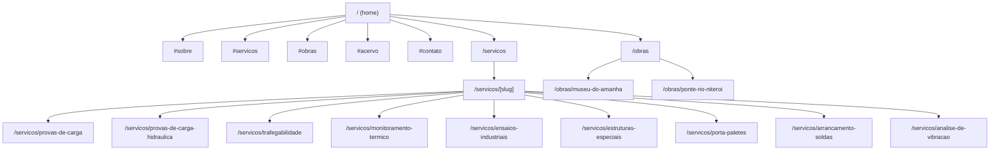

# Diagrama de Rotas — OFM Engenharia

Mapa completo das rotas geradas no export estático do site.

## Notas

- Âncoras (`#sobre`, `#servicos`, etc.) são seções da página principal — não são rotas separadas.
- `/servicos/[slug]` é uma rota dinâmica com `generateStaticParams` — cada slug vira uma página estática no build.
- `/obras/[slug]` não usa rota dinâmica — cada página de obra é um arquivo estático dedicado.
- Todas as rotas geram arquivos `.html` na pasta `/out` via `output: 'export'`.
